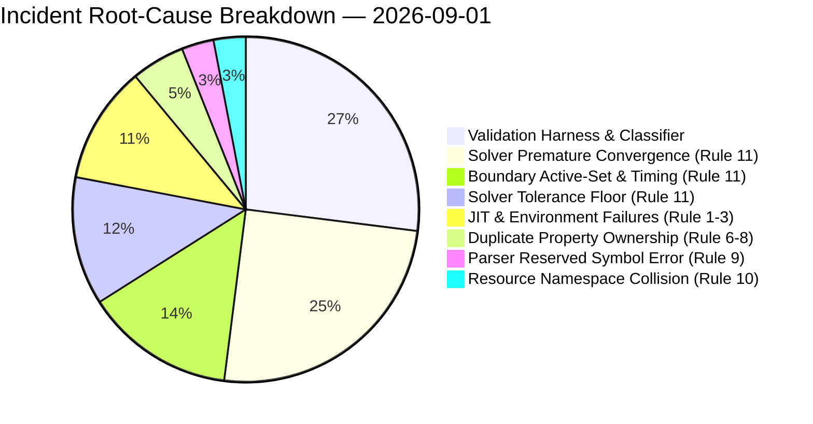

# Incident Root-Cause Breakdown — 2026-09-01

- **Snapshot date:** 2026-09-01
- **Metric type:** Accumulated root-cause distribution
- **Scope:** Operational incident/error analysis
- **Status:** Historical snapshot; do not overwrite when later distributions change

## 1. Reported accumulated distribution

| Rank | Root-cause category | Share | Representative failure modes |
|---:|---|---:|---|
| 1 | Validation Harness & Classifier | 27% | Floating-point representation equivalence comparison failure; CSV initial-row contamination; analyzer mean aggregation error; harness sentinel mismatch |
| 2 | Multi-Physics Solver Convergence | 25% | Premature nonlinear convergence / residual masking; `C(s)=5/(4+s)` |
| 3 | Boundary Active-Set & Timing | 14% | Zero-IC active-set amplification / secondary application effect |
| 4 | Solver Tolerance Floor | 12% | `nl_abs_tol < R_floor` leading to line-search divergence |
| 5 | JIT & Environment Failures | 11% | `rc=127`; `.jitcache`; binary transfer/environment issues |
| 6 | Property Ownership Duplicate | 5% | Duplicate `T_g` material producer |
| 7 | Parser Reserved Symbol | 3% | FunctionParser collision with reserved coordinate/time symbols `x,y,z,t` |
| 8 | Resource Namespace Collision | 3% | Path pre-create collision |

**Total:** 100%

## 2. Operational roll-up (derived analysis)

The following grouping is derived from the reported percentages and is not a replacement for the original taxonomy.

| Operational layer | Included categories | Share |
|---|---|---:|
| Solver / numerical execution | Multi-Physics Solver Convergence + Boundary Active-Set & Timing + Solver Tolerance Floor | **51%** |
| Validation / observability | Validation Harness & Classifier | **27%** |
| Runtime environment | JIT & Environment Failures | **11%** |
| Configuration / ownership / namespace | Property Ownership Duplicate + Parser Reserved Symbol + Resource Namespace Collision | **11%** |

### Immediate interpretation

1. **Solver-side behaviour is the dominant incident surface (51%).** Convergence criteria, active-set timing, and tolerance-floor handling should be treated as the primary operational reliability target.
2. **Validation infrastructure is the largest single category (27%).** A material fraction of observed failures can originate in the mechanism used to classify or validate the run rather than in the solver itself.
3. **Environment failures are non-trivial (11%).** JIT/cache/binary execution should remain a separately observable operational layer so infrastructure faults are not misclassified as physics or solver defects.
4. **The remaining 11% is fragmented configuration risk.** Ownership, parser symbols, and namespace collisions are individually small but collectively worth preventing through pre-flight checks and explicit ownership contracts.

## 3. Source distribution chart

## 4. Snapshot discipline

Future measurements should be stored as new date-stamped files under `docs/metrics/incidents/snapshots/`. Historical percentages in this file should remain unchanged so distribution shifts can be compared over time.
